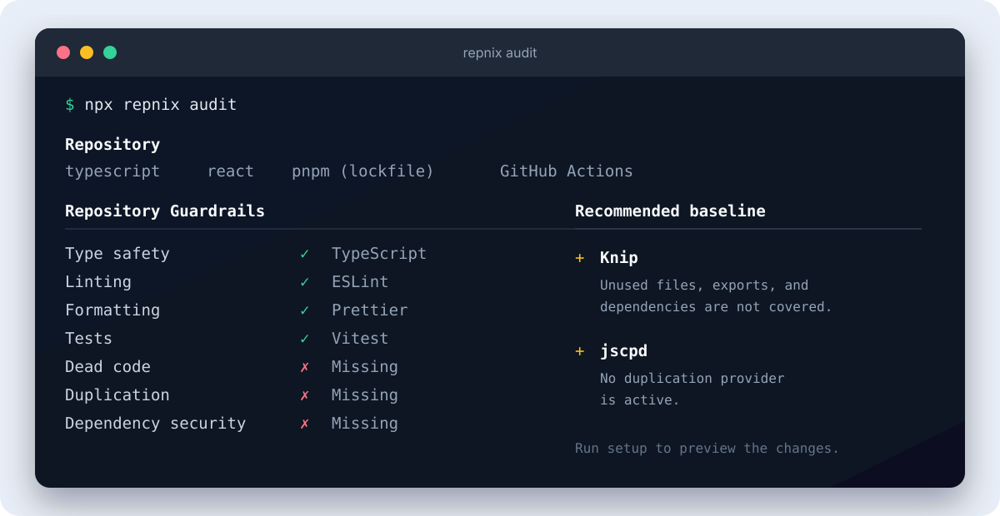
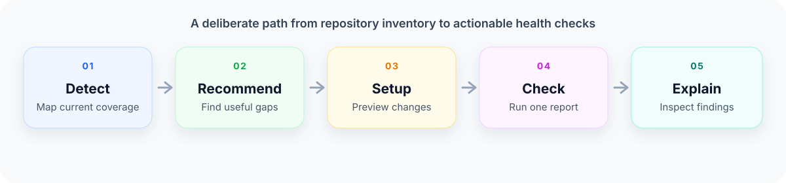

# RepNix

[](https://www.npmjs.com/package/repnix)
[](https://github.com/zakaihamilton/repnix/actions/workflows/ci.yml)
[](https://github.com/zakaihamilton/repnix/actions/workflows/e2e.yml)
[](LICENSE)

**Discover and run the checks that keep your JavaScript or TypeScript repository safe to change.**

RepNix is a local-first CLI that explains the guardrails you already have, identifies useful gaps, and helps you add a focused set of complementary tools. It then gives your team one command for running repository health checks locally and in CI.

If terms such as “dead code,” “dependency security,” or “package health” are new to you, start with `repnix audit`. It explains each category in plain language before recommending anything.

RepNix orchestrates the tools you choose. It does not replace your existing TypeScript, ESLint, Biome, Prettier, Vitest, Jest, Knip, OSV-Scanner, dependency-cruiser, or package-quality workflows.



## Get started

Requirements: **Node.js 20+** and one of **npm, pnpm, Yarn, or Bun**.

Install RepNix as a development dependency:

```bash
npm install --save-dev repnix
```

Then inspect your repository. This is read-only and does not install packages or edit files:

```bash
npx repnix audit
```

If RepNix recommends checks you want to add, run the interactive setup. It explains why each check matters and previews every package, script, configuration file, and CI change before applying anything:

```bash
npx repnix setup
```

Setup requires an interactive terminal. If you are working in a non-interactive environment, use `repnix audit` to review recommendations and make the project changes yourself.

Once setup is complete, run the unified health check:

```bash
npm run health
```

For detailed explanations of findings, use:

```bash
npx repnix check
npx repnix explain
```

## A beginner-friendly workflow

Think of repository health as a set of safety nets:

- **Type safety** catches mismatched values before the program runs.
- **Linting and formatting** catch risky patterns and keep code consistent.
- **Tests** protect behavior when code changes.
- **Dead-code and duplication checks** find code that is unused or repeated.
- **Security checks** look for known vulnerabilities in third-party dependencies.
- **Architecture and bundle checks** protect module boundaries and shipped JavaScript size.
- **Package publishing checks** verify what npm consumers will receive.

RepNix detects which of these apply to your repository and shows the next useful step. A recommendation is not automatically a problem: optional checks often need a project-specific rule or budget before they can be useful.

## Why RepNix?

Most repositories accumulate quality tools one at a time. That makes it easy to miss important coverage, add overlapping analyzers, or leave CI with a collection of unrelated commands.

RepNix gives you a clear inventory and a deliberate next step:

- **Works with your repository.** Detects the package manager, framework, language, monorepo layout, CI, scripts, configuration, and installed providers already in use.
- **Measures active coverage.** An installed package is not treated as a health check unless it is configured and actually contributes a capability.
- **Adds only useful gaps.** Recommendations are based on the repository’s shape and existing tools, with baseline, optional, and advanced priorities.
- **Preserves your choices.** Setup keeps existing scripts and configuration, creates only the files it needs, and shows conflicts instead of overwriting them blindly.
- **Stays local-first.** `audit`, `check`, and `explain` do not install packages or access a package registry. Security and package-health checks use local/offline execution paths.
- **Produces one report.** Human-readable output groups findings by category and provider; `--json` emits a versioned normalized report for automation.

## The workflow

```text
audit → choose recommendations → setup → check → explain
```



1. **Audit** the repository without modifying it.
2. **Choose** the providers that fit your project.
3. **Set up** packages, scripts, configuration, and optional CI integration through a previewed plan.
4. **Check** all active health providers with one command.
5. **Explain** findings with normalized messages, locations, severity, and provider attribution.

### How to read the output

- A **category** is the kind of protection being measured, such as tests or dependency security.
- A **provider** is the tool that performs the check, such as Vitest, Knip, or OSV-Scanner.
- **Covered** means an active provider contributes the capability. **Partly covered** means some related capabilities are active but a gap remains. **Missing** means no active provider was found.
- A **finding** is an issue reported by a check. A **check error** means the tool could not finish, usually because setup or configuration needs attention.
- `repnix audit` is for deciding what to add. `repnix check` is for a quick pass/fail result. `repnix explain` is for deciding what to do about a finding.

If `repnix check` says that no applicable health checks ran, RepNix did not find an active provider for that category. That is not the same as being covered; run `repnix audit` to see whether a provider is missing, disabled, or not relevant to the repository.

### Setup guidance

`repnix setup` is an interactive, opt-in change flow:

- In a capable terminal, setup opens a full-screen keyboard-driven dashboard with provider selection, a change summary, optional file details, and an explicit apply confirmation.
- Baseline recommendations are preselected because they are useful for most JavaScript and TypeScript repositories.
- Optional and advanced recommendations are not automatically enabled when they need project-specific rules or budgets.
- Use **↑/↓** or **j/k** to move, **Space** to select or clear a provider, **Enter** to continue, **d** to inspect file details, **a** to begin the apply confirmation, and **Esc/q/Ctrl+C** to leave safely before applying. While changes are being applied, exit keys are disabled until the rollback-safe operation finishes.
- Before confirmation, RepNix shows the packages, scripts, configuration files, and optional CI changes it plans to apply. Existing files are preserved and conflicts are shown for review.
- Some recommendations need preparation outside RepNix: OSV-Scanner needs its binary and local vulnerability database, architecture checks need module-boundary rules, and bundle checks need an explicit size budget.

If the terminal is too small or does not support the full-screen dashboard, RepNix falls back to its sequential prompts. Non-interactive environments should use `repnix audit` for a read-only review.

After setup completes, run `repnix check`. If it reports findings or a provider error, run `repnix explain` for the next place to look.

## See it in action

```text
$ npx repnix audit

Repository health audit

RepNix looks at the checks already protecting this repository, then points out useful gaps.

typescript
react
pnpm (lockfile)
GitHub Actions

Repository Guardrails
────────────────────────────────────────────────
✓ covered   ◐ partly covered   ✗ missing   – off = disabled   – n/a = not relevant
Type safety                 ✓ TypeScript
Linting                     ✓ ESLint
Formatting                  ✓ Prettier
Tests                       ✓ Vitest
Dead code                   ✗ Missing
Duplication                 ✗ Missing
Dependency security         ✗ Missing

Recommended baseline — start here
────────────────────────────────────────────────
+ Knip
  What it checks: Finds unused files, exports, and dependencies.
  Nothing currently checks for unused files, exports, or dependencies. This helps remove stale code and keeps dependencies intentional.

+ jscpd
  What it checks: Finds copy-and-paste code that may become inconsistent.
  58 source files can accumulate copy-and-paste drift, and no duplication check is active. This helps you find repeated code before the copies start behaving differently.
```

After setup, the unified check stays intentionally small:

```text
$ npx repnix check

Repository health check

Type safety            ✓  TypeScript
Linting                ✓  ESLint
Formatting             ✓  Prettier
Tests                  ✓  Vitest
Dead code              ⚠  2  Knip
Duplication            ✓  jscpd

2 findings need attention at the configured severity threshold.

Next: run repnix explain to see what each finding means and where to start.
```

## Commands

| Command | Purpose | Changes files? |
| --- | --- | :---: |
| `repnix audit` | See what your repository already checks, what is missing, and why it matters. | No |
| `repnix setup` | Review and apply recommended checks through an interactive preview. | Yes, after confirmation |
| `repnix check` | Run all active health checks and get a short result. | No |
| `repnix check <category>` | Run one category, such as `dead-code` or `security`. | No |
| `repnix check --json` | Emit a versioned normalized report to stdout. | No |
| `repnix <command> --verbose` | Show debug diagnostics and stream provider output to stderr. | No |
| `repnix <command> --quiet` | Suppress diagnostic output while keeping the command report. | No |
| `repnix <command> --log-level <level>` | Set diagnostics to `silent`, `error`, `warn`, `info`, or `debug`. | No |
| `repnix <command> --log-format json` | Emit newline-delimited structured diagnostics on stderr. | No |
| `repnix <command> --timeout <seconds>` | Set the maximum runtime for each repository command; the default is five minutes. | No |
| `repnix explain` | Rerun checks and explain findings, locations, severity, and next steps. | No |

Examples:

```bash
# Read-only inventory of existing coverage
npx repnix audit

# Interactive setup for recommended providers
npx repnix setup

# Run everything currently configured
npx repnix check

# Run one category
npx repnix check dead-code
npx repnix check package-health

# Send machine-readable output to another tool
npx repnix check --json > repnix-report.json

# Inspect locations and provider-specific explanations
npx repnix explain
```

## What each health category means

RepNix separates repository health into categories so each capability has a clear home. The category name is also the value you can pass to `repnix check <category>`.

| Category | What it protects | Typical tools |
| --- | --- | --- |
| `types` — Type safety | Catches mismatched values before runtime. | TypeScript |
| `lint` — Linting | Finds suspicious or inconsistent code patterns. | ESLint, Oxlint, Biome |
| `format` — Formatting | Keeps code style consistent. | Prettier, Oxfmt, Biome |
| `tests` — Tests | Protects existing behavior from regressions. | Jest, Vitest, safe test scripts |
| `dead-code` — Dead code | Finds unused files, exports, and dependencies. | Knip |
| `duplication` — Duplication | Finds repeated code that can drift apart. | jscpd |
| `security` — Dependency security | Finds known vulnerabilities in dependencies. | OSV-Scanner |
| `architecture` — Architecture boundaries | Protects allowed relationships between modules. | dependency-cruiser, `eslint-plugin-boundaries` |
| `bundle` — Bundle regression | Protects shipped JavaScript size. | Size Limit |
| `package-health` — Package publishing | Checks what npm consumers receive. | Publint, Are The Types Wrong? |

### Existing project checks

RepNix detects and runs the safe commands your repository already uses for:

- Type safety — TypeScript.
- Linting — ESLint, Oxlint, or Biome.
- Formatting — Prettier, Oxfmt, or Biome.
- Tests — Jest, Vitest, or a safe existing test script.

### Specialist checks

When the repository needs additional coverage, RepNix can recommend and orchestrate:

- **Dead code:** Knip for unused files, exports, and dependencies.
- **Duplication:** jscpd for copy/paste drift.
- **Dependency security:** OSV-Scanner using its offline vulnerability database.
- **Architecture:** dependency-cruiser or active `eslint-plugin-boundaries` rules.
- **Bundle size:** Size Limit when an explicit budget already exists.

### Package publishing

Publishable npm packages can also use:

- **Publint** for exports, entry points, module formats, package metadata, and published files.
- **Are The Types Wrong?** for TypeScript consumer compatibility across Node and bundler resolution modes.

Package-health checks analyze a local packed artifact with lifecycle scripts disabled. They do not implicitly run a repository `prepack` script or fetch registry data.

## Configuration

Configuration is optional. Add `repnix.config.json` when your team wants to make a category required, change which findings fail CI, or intentionally disable a provider:

```json
{
  "categories": {
    "dead-code": "required",
    "duplication": "optional",
    "architecture": "off"
  },
  "severityThreshold": "warning",
  "providers": {
    "jscpd": { "enabled": true },
    "osv-scanner": { "enabled": true },
    "dependency-cruiser": { "enabled": true },
    "publint": { "enabled": true },
    "attw": { "enabled": true }
  }
}
```

Category modes are:

- `required` — the category must have an active provider; otherwise the check fails with exit code `2`.
- `optional` — run the category when a provider is active, but do not require setup.
- `off` — skip the category intentionally.

Severity thresholds are `info`, `warning`, and `error`. A finding at or above the threshold produces exit code `1`. Configuration is strict, so misspelled categories and provider names fail with a correction tip.

Use `required` for coverage that must exist, `off` for categories that do not apply to your repository, and provider flags when you want to keep a detected tool out of the RepNix run.

## Exit codes and automation

RepNix uses predictable exit codes so both people and CI can understand the result:

- `0` — all configured checks passed at the configured severity threshold.
- `1` — one or more findings reached the configured threshold; run `repnix explain` to understand them.
- `2` — RepNix could not complete a check because of configuration, repository detection, or tool execution; this is different from a code finding.

`repnix check --json` writes the versioned report to stdout. With debug diagnostics (`--verbose` or `--log-level debug`), child provider output goes to stderr so stdout remains machine-readable.
All commands accept the diagnostic options. `--verbose` is shorthand for `--log-level debug`; `--quiet` takes precedence over the other level switches. Use `--log-format json` when a log collector needs stable event names and context fields. If an unexpected error occurs, verbose mode includes its stack trace.

### GitHub Actions

After installing dependencies, add the unified check to an existing GitHub Actions job:

```yaml
- name: Check repository health
  run: npm run health
```

For machine-readable CI integrations, use `npx repnix check --json` and redirect or collect stdout as an artifact.

## How it works

RepNix follows a detect → recommend → plan → run model:

1. Detect repository type, package manager, source roots, scripts, CI, configuration, and active provider capabilities.
2. Compare those capabilities with the health categories that apply to the repository.
3. Build a minimal installation plan that preserves existing project choices.
4. Run active providers and normalize their findings into a shared report with category, severity, provider, and location.

The audit and reporting pipeline is designed to be safe to run locally and in CI. `setup` is the only command that can make changes, and it requires an explicit confirmation after showing the planned commands and file changes.

## Notes and current limits

- Monorepos use their existing root orchestration scripts; RepNix does not independently traverse every workspace.
- Existing repository scripts are only run when they look like non-mutating quality checks. Scripts containing fix, write, watch, install, publish, deployment, or other mutating commands are skipped and the configured provider fallback is used where available.
- Setup applies planned files atomically and restores planned files plus package-manager lockfiles if dependency installation fails. Package-manager lifecycle scripts can still run during a normal dependency installation.
- Specialist lint, type, formatting, test, `eslint-plugin-boundaries`, and Size Limit output is represented as a provider-attributed command finding. Knip, jscpd, OSV-Scanner, dependency-cruiser, Publint, and Are The Types Wrong? receive detailed normalization.
- Accessibility and monorepo-consistency providers are not yet available in the MVP.
- OSV-Scanner must be installed separately with its local vulnerability database prepared before security coverage can be required.
- Architecture rules and bundle budgets are repository-specific. RepNix does not invent boundary policies or size budgets.

## Development

```bash
pnpm install
pnpm verify
```

The package uses Node.js ESM, strict TypeScript, and Vitest. See [CONTRIBUTING.md](CONTRIBUTING.md) for the provider-adapter workflow and pull-request guidelines.

Run the packaged smoke test locally after building:

```bash
pnpm build
pnpm test:package
```

The disposable consumer and provider acceptance tests are available through:

```bash
pnpm test:e2e
pnpm test:phase2
pnpm test:phase3
```

## Learn more

- [npm package](https://www.npmjs.com/package/repnix)
- [GitHub repository](https://github.com/zakaihamilton/repnix)
- [Report an issue](https://github.com/zakaihamilton/repnix/issues)
- [Contributing guide](CONTRIBUTING.md)
- [Release history](CHANGELOG.md)
- [MIT license](LICENSE)

## Releases

Every push to `main` triggers the publish workflow. It runs the full project verification, checks whether the package version is already on npm, and publishes only new versions through npm trusted publishing. The workflow can also be started manually from GitHub Actions.
